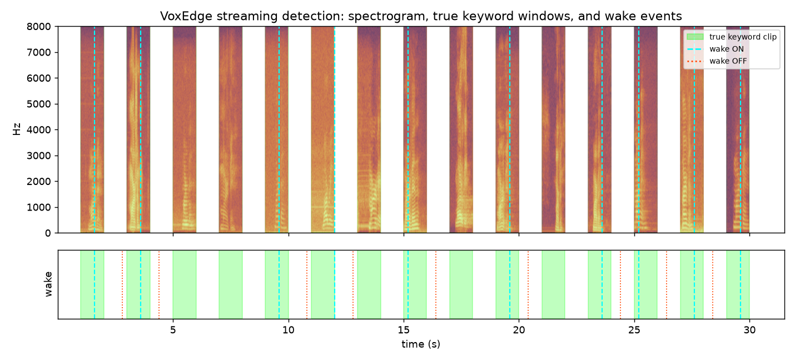

# VoxEdge

An on-device wake-word (keyword-spotting) audio pipeline for the nRF52840 (Arduino Nano 33 BLE
Sense), built and evaluated **entirely under [Renode](https://renode.io/)** — no physical board or
microphone. Renode executes the real compiled ARM binary; only the microphone is simulated, by
playing WAV/PCM files into Renode's emulated PDM peripheral. Everything downstream — the FreeRTOS
task architecture, the CMSIS-DSP feature extraction, the int8 TFLite-Micro model, the watchdog — is
the real firmware that would run on a physical board.

The wake word is **"marvin"** (Speech Commands v0.02).

## Quick start

```bash
git clone https://github.com/vansh-shriv/VoxEdge.git && cd VoxEdge
git submodule update --init                 # FreeRTOS-Kernel, CMSIS-DSP, CMSIS_6, tflite-micro
bash tools/fetch_tflm_deps.sh                # flatbuffers, gemmlowp, ruy, CMSIS-NN (MD5-verified)
bash tools/run_phase4.sh                     # build + run the deployed model in Renode + check parity
```

Needs [Renode](https://renode.io/) and the [Arm GNU Toolchain](https://developer.arm.com/downloads/-/arm-gnu-toolchain-downloads)
installed (see `CLAUDE.md` for exact versions and Windows-specific setup notes — this project was
built and tested on Windows/Git Bash). Python tooling needs `numpy scipy librosa soundfile
tensorflow` (`ml/requirements.txt`).

## Architecture

```
 PCM file (host)
     │  Renode PDM peripheral playback (sysbus 0x4001D000, IRQ 29)
     ▼
 PDM ISR ──double-buffer──▶ stream buffer ──▶ [Capture task]  prio 5
                                                    │ 30 ms windows (10 ms hop)
                                                    ▼
                                              [DSP task]       prio 4
                                     CMSIS-DSP 512-pt rFFT → 40 log-mel
                                     features, quantised into a 98-frame
                                     ring buffer (last 980 ms of audio)
                                                    │ every 400 ms, ring snapshot
                                                    ▼
                                              [Inference task] prio 3
                                     TFLite-Micro, int8 DS-CNN, CMSIS-NN
                                     kernels → P(marvin) → threshold
                                                    │ wake / event
                                                    ▼
                                              [Telemetry task] prio 1
                                  UART stats, wake events, hardware
                                  watchdog feed (nRF52840 WDT, 2 s)
```

Priorities run highest→lowest in the order above; the idle task sleeps (`WFI`) whenever nothing is
ready. This ordering is deliberate: a stall in DSP or inference can never block capture (which sits
above both), and starves only telemetry — including its watchdog feed — which is exactly how the
watchdog recovers the system from an unbounded hang (see [Robustness](#robustness) below).

See `docs/PROGRESS.md` for the full build log (every phase's decisions, results, and gotchas) and
`voxedge-spec-simulator.md` for the original design brief.

## Model

Three DS-CNN sizes were trained and compared (`ml/train.py`, `ml/quantize.py`); **`s`** (4,083
params, 1.67 M MACs) is deployed, running with CMSIS-NN int8 kernels at `-O2`.

| model | MACs | int8 size | int8 hit rate, clean/noisy (1 s clips, isolated) |
|---|---|---|---|
| xs | 0.72 M | 9.6 KB | 72.3 / 54.9 % |
| **s** (deployed) | 1.67 M | 15.6 KB | 87.7 / 84.6 % |
| m | 6.43 M | 34.0 KB | 91.3 / 89.2 % |

On the emulated Cortex-M4F (64 MHz assumed): `s` costs **10.46 M instructions/inference (≈163 ms)**
with CMSIS-NN vs **199 M (≈3.1 s)** with TFLite-Micro's plain reference kernels — a 19x speed-up from
CMSIS-NN alone. Feature extraction costs ≈39 k instructions (≈0.6 ms) per 10 ms hop. Deployed
pipeline load: **≈46 % of a 64 MHz core**, 129.7 KB flash, 136 KB RAM.

## Streaming evaluation

The table above is the *clip-level* number: each 1 s clip scored in isolation, keyword centred —
the standard way to report a KWS model's accuracy, and useful for comparing model sizes, but not a
measurement of what the deployed pipeline actually does with continuous audio. Phase 6 measures
that directly: the deployed firmware (`s`, CMSIS-NN, `-O2`, one inference every 400 ms, wake at
P(marvin) ≥ 0.9) runs in Renode against **continuous streams** built from the Speech Commands *test
split only* (never trained or validated on) via `tools/make_eval_streams.py` /
`tools/run_phase6_eval.sh`:

| stream | content | result |
|---|---|---|
| positive, clean | 80 marvin clips, 1 s silence gaps | **81.2 % hit rate** (65/80) |
| positive, noisy | same 80 clips + background noise at 5 dB SNR | **61.3 % hit rate** (49/80) |
| negative | 30 min of unknown-word clips + background noise | **2.00 false accepts/hour (1 event in 30 min)** |

The streaming clean-hit-rate (81.2 %) lands close to the clip-level number for `s` at the same
threshold (81.5 %), which says the 400 ms/980 ms-window streaming setup does not cost much accuracy
by itself; the noisy-stream number is lower than its clip-level counterpart (61.3 % vs 75.4 %),
consistent with real, continuously-varying background noise being harder than the fixed 10 dB SNR
used for the clip-level noisy test set.



*First 30 s of the positive-clean stream. Green bands are the true keyword windows; the dashed cyan
line is a wake-ON event, the dotted red line is wake-OFF. Three misses are visible in this excerpt —
consistent with the 81.2 % overall hit rate.*

## Robustness

Phase 5 exercises spec §4.4 directly, using the real firmware (`docs/PROGRESS.md` has full results):

- **Deliberate stalls**: a compile-time-gated busy-loop (`STALL_TASK`/`STALL_AT_SEQ`/`STALL_MS`) in
  the DSP or inference task. A 600 ms stall in either task: **zero PDM overruns**, the downstream
  backlog is counted rather than corrupted, and the pipeline resumes on its own once the stall ends.
- **Hardware watchdog**: a real nRF52840 WDT, fed only by the lowest-priority telemetry task. An
  unbounded stall starves the feed and the watchdog forces a full reset — verified via a second boot
  banner in the UART log.
- **Pathological audio**: digital silence, 4× hard-clipped tone, full-scale white noise, and a mixed
  clip with abrupt transitions between them all run without a crash, hang, or out-of-range model
  output.
- **Long-run stability**: 4 minutes of concatenated negative audio — zero overruns/drops throughout,
  and every stack/heap high-water mark settles early and stays flat (no leak signature).

## What this project does *not* measure

**Power/current draw was not measured** — there is no meaningful way to do that with a simulated
microphone and no physical board, and inventing a number would be dishonest. This project targets
DSP correctness, RTOS scheduling, on-device inference correctness, and detection accuracy/robustness
under a simulated microphone input, not power characterisation. The firmware's idle task does
execute `WFI` between interrupts (verified via the emulated instruction-count trace showing the core
otherwise busy only during real work), which is the sleep-mode behaviour a power-aware build would
rely on — see `docs/PROGRESS.md` Phase 2 for that evidence.

Cycle/latency numbers throughout this project come from an emulated instruction counter (Renode has
no real DWT model), assumed to run at 64 MIPS / 1 instruction-per-cycle. Real silicon has flash wait
states and multi-cycle FPU/load-use stalls that this does not model, so every cycle figure here is a
lower bound, not a hardware measurement.

## Repository layout

```
firmware/        FreeRTOS C/C++ firmware: src/{tasks,dsp,model}, wdt.c, debug_stall.c
                  firmware/phase0/ is the earlier bare-metal (no-RTOS) reference from Phase 0
ml/               Feature reference (features.py — the definition tools/gen_dsp_tables.py compiles
                  into firmware), dataset prep, model, training, quantisation, evaluation
sim/              platform.repl (board + DWT shim), boot.resc, wav_corpus/ (all test audio)
tools/            Generators, cross-checks against the Python reference, phase runner scripts
third_party/      Git submodules (FreeRTOS-Kernel, CMSIS-DSP, CMSIS_6, tflite-micro) +
                  tflm_deps/ (fetched by tools/fetch_tflm_deps.sh, git-ignored)
docs/PROGRESS.md  The full build log: every phase's decisions, results, gotchas, and open caveats
.github/workflows/ci.yml   Fast regression gate (Phases 0/1/2/4/5); see the file for what's excluded and why
```

## Status

All six phases of the original design (`voxedge-spec-simulator.md`) are complete: simulated audio
ingestion, the FreeRTOS pipeline, CMSIS-DSP features, model training, on-device TFLite-Micro
inference, robustness testing, and this streaming evaluation. `docs/PROGRESS.md` is the detailed,
phase-by-phase record — read it for anything this README summarises.
